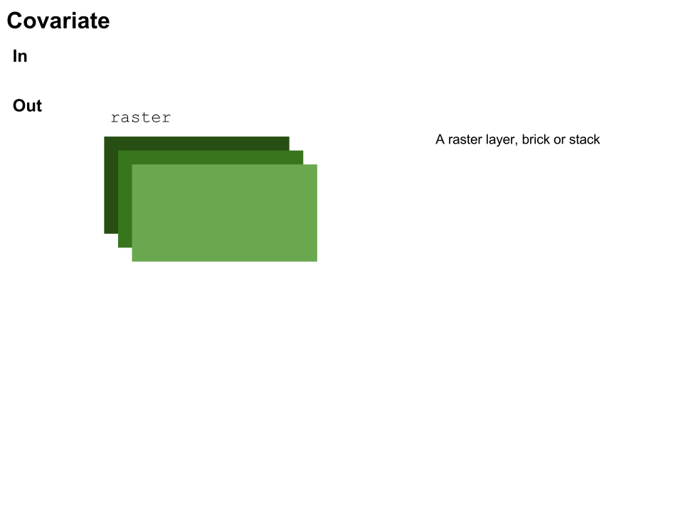
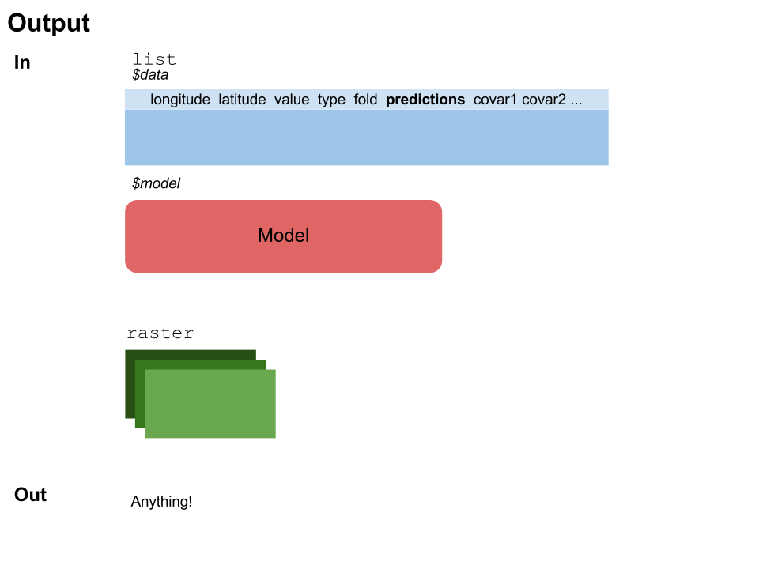

<!--
%\VignetteEngine{knitr::knitr}
%\VignetteIndexEntry{Building modules}
-->

```{r, echo = FALSE}
invisible(require(zoon, quietly = TRUE, verbose = FALSE))
```

## The "1, 2, 3" of module building

The process of making a module is essentially

1. Write an R function
2. Run `BuildModule` with the function and metadata
3. *Optional* -- Upload to the zoon modules repository

Each module type is slightly different to write thought the same three basic steps apply. Below we show an example of how to write each of the module types. We also link to pre-existing modules that you can use as templates.

## How to build an occurrence module

The aim of an occurrence module is to return a data.frame of occurrence data which can be used for modelling a species distribution. The example I'm going to show gets data from a fictional survey we have undertaken. The data was saved as a .csv and to share it we have placed it on Figshare.

```{r, eval = FALSE}
# Load zoon
library(zoon)

# Start building our function
Lorem_ipsum_UK <- function(){
```

In this case we have not given our function any arguements as we simply want to return the online dataset. However you could add arguements here to modify what your function returns (for an example [see the SpOcc module](https://github.com/zoonproject/modules/blob/master/R/SpOcc.R)).

```{r, eval = TRUE}
# I'm going to use the package 'RCurl' so first I get that
# using the zoon 'GetPackage' function
GetPackage('RCurl')
```  

It is important that you use the `GetPackage` function rather than `library` or `require` as it will also install the package if the user does not already have it installed. 
  
```{r, eval = FALSE}
# Next I retrieve the data from figshare
URL <- "http://files.figshare.com/2519918/Lorem_ipsum_data.csv"
x <- getURL(URL)
out <- read.csv(textConnection(x))
```

Now it is time to think about how we return our data

### Occurrence model output format

The output format for occurrence modules is very important. If you do not ensure that the format is correct then your module will not work properly when entered into a workflow. Here is what you need to know.

An occurrence module must return a dataframe with the columns longitude, latitude, value, type and fold:

- *Longitude*: The longitude of the observation (or absence)
- *Latitude*: The latitude of the observation (or absence)
- *Value*: The value of the observation. This can be 1 or 0 for presence/absence, an interger for abundance (e.g. 1, 3, 67), or a decimal number between 0 and 1 for proportions (e.g. 0.12, 0.5, 0.98)
- *Type*: This is linked to Value above and dictates for each row of the dataframe the type of value given. This can be one of the following; 'presence', 'absence', 'background', 'abundance', 'proportion'.
- *Fold*: Folds are used to test your model. If we have, for example, 3 folds (1, 2, 3) then we can use the [PerformanceMeasures output module](https://github.com/zoonproject/modules/blob/master/R/PerformanceMeasures.R) to test the performance of the model. A common method, implemented by `PerformanceMeasures` is to build the model using all but one fold, and then test the models ability to predict the fold that was held back.  

Our occurrence data does not have all of these columns so we need to add them. Here is what our data currently looks like.

```{r, echo = FALSE, message = FALSE}
URL <- "http://files.figshare.com/2519918/Lorem_ipsum_data.csv"
x <- getURL(URL)
head(read.csv(textConnection(x)))
```

So we need to do a little reformating

```{r, eval = FALSE}
# Keep only Lat Long columns
out <- out[, c("latitude", "longitude")]

# Add in the columns we dont have
out$value <- 1 # all our data are presences
out$type <- 'presence'
out$fold <- 1 # we don't add any folds

# Now the data is in the correct format we can return it
return(out)
```

We have now written the R code for our occurrence module, this is what it looks like when you put it all together.

```{r}
Lorem_ipsum_UK <- function(){
  
  GetPackage('RCurl')
  
  # Get data
  URL <- "http://files.figshare.com/2519918/Lorem_ipsum_data.csv"
  x <- getURL(URL)
  out <- read.csv(textConnection(x))
  out <- out[, c("latitude", "longitude")]
  
  # Add in the columns we dont have
  out$value <- 1 # all our data are presences
  out$type <- 'presence'
  out$fold <- 1 # we wont add any folds
  
  return(out)
}
```

Now that we have our function written we can test it very simply in a workflow like this.

```{r, fig.width = 5, fig.height = 5}
workl1 <- workflow(occurrence = Lorem_ipsum_UK,
                   covariate = UKBioclim,
                   process = OneHundredBackground,
                   model = LogisticRegression,
                   output = PrintMap)
```

This is a nice way to debug your code and ensure you are getting the results you expect.

Once you are happy that your code is working as you expect it to you can build you code into a module using the `BuildModule` function in `zoon`. This script adds in metadata including the authors' names, the parameter definitions, etc.

```{r}
# Let's build our module
BuildModule(Lorem_ipsum_UK,
            type = 'occurrence',
            title = 'A dataset of Lorem ipsum occurrences',
            description = paste0('The module retrieves a dataset of',
            'Lorem ipsum records from figshare. This dataset contains',
            'precence only data and was collected between 1990 and',
            '2000 by members of to Lorem ipsum appreciation society'),
            details = 'This dataset is fake, Lorem ipsum does not exist',
            author = 'A.B. Ceidi',
            email = 'ABCD@anemail.com',
            dataType = 'presence-only')
```

This function is fairly self explanitory however it is worth noting the dataType field. This must be any of 'presence-only', 'presence/absence', 'abundance' or 'proportion'. This is important so that people using your module in the future will know what it is going to output. 

We will now have an R file in our working directory that represents our module and can be shared with others.

```{r, eval = FALSE}
# First we remove the function from our workspace
rm(list = 'Lorem_ipsum_UK')

# This is how you would use a module that a colleague has sent you
LoadModule(module = 'Lorem_ipsum_UK.R')

work2 <- workflow(occurrence = Lorem_ipsum_UK,
                  covariate = UKBioclim,
                  process = OneHundredBackground,
                  model = LogisticRegression,
                  output = PrintMap)
```

Once we're happy with the module, we will hopefully upload it to the zoon repository. The repository is currently under development. Visit [the development pages](https://zoonproject.wordpress.com/) for more information.

## How to write a covariate module

The aim of a covariate module is to provide spatial information that will help to explian the distribution of a species. For example this data could be climate data, habitat data or topology.

A covariate module, like an occurrence module, does not have to take any arguements but must return a raster layer, brick or stack.

In this example we will create a covariate module that can provide a number of different climate layers for the area covering Australia.

```{r, eval = FALSE}
# Our function will take an arguement to set the variable
# the user wants returned
AustraliaAir <- function(variable = 'rhum'){
```

When your module has arguements, as here, it is important to include default for all arguements. This make it easier for other users to use your modules and allows your module to be tested effectivly when you upload it to the zoon repository.

The first step is to load the R pacakges that your code is going to need. It is important that you use the `GetPackage` function rather than `library` or `require` as it will also install the package if the user does not already have it installed. In this example we do not need any external packages.

The data we want to share is currently a rasterstack object in R.

```{r, echo = FALSE}
URL <- "http://files.figshare.com/2527274/aus_air.rdata"
load(url(URL))
print(ras)
```

To share this we have saved the object as an R data file and [placed it on Figshare](http://figshare.com/articles/NCEP_Australia/1610215), being sure to attribute those that created the data. 

In our function we can then download this data into R

```{r, eval = FALSE}
# Load in the data
URL <- "http://files.figshare.com/2527274/aus_air.rdata"
load(url(URL)) # The object is called 'ras'

# Subset the data according the the variable parameter
ras <- subset(ras, variables)

return(ras)
```

We can test our function works by running it in a workflow with other modules

```{r, fig.width = 5, fig.height = 5}
AustraliaAir <- function(variables = 'rhum'){

  URL <- "http://files.figshare.com/2527274/aus_air.rdata"
  load(url(URL)) # The object is called 'ras'
  ras <- subset(ras, variables)
  return(ras)
  
}

# Select the variables we want
myVariables <- c('air','hgt','rhum','shum','omega','uwnd','vwnd')

work3 <- workflow(occurrence = SpOcc(extent = c(111, 157, -46, -6),
                                     species = 'Varanus varius',
                                     limit = 500),
                  covariate = AustraliaAir(variables = myVariables),
                  process = OneHundredBackground,
                  model = LogisticRegression,
                  output = PrintMap)
```

Once we are happy with the function we have written we need to use the `BuildModule` function to convert our function into a module by adding in the nessecary metadata

```{r}
# Build our module
BuildModule(AustraliaAir,
            type = 'covariate',
            title = 'Australia Air data from NCEP',
            description = paste('This modules provides access to the',
                                'NCEP air data for austrlia provided by',
                                'NCEP and should be attributed to Climatic',
                                'Research Unit, University of East Anglia'),
            details = paste('These data are redistributed under the terms of',
                            'the Open Database License',
                            'http://opendatacommons.org/licenses/odbl/1.0/'),
            author = 'Z.O. Onn',
            email = 'zoon@zoon-zoon.com',
            paras = list(variables = paste('A character vector of air variables',
                         'you wish to return. This can include any number of',
                         "the following: 'air','hgt','rhum','shum','omega',",
                         "'uwnd','vwnd'")))
```

`BuildModule` is fairly self explanitory but it is worth noting the `paras` arguement. This takes a named list of the parameters the module takes. This should follow the following structure; *list(parameterName = 'Parameter description.', anotherParameter = 'Another description.')* 

Once `BuildModule` has been run there will be an R file in our working directory that represents our module and can be shared with others. This R script can be used as follows.

```{r, eval = FALSE}
# remove the original function from our environment
rm(list = 'AustraliaAir')

# Load the module script
LoadModule('AustraliaAir.R')

work4 <- workflow(occurrence = SpOcc(extent = c(111, 157, -46, -6),
                                     species = 'Varanus varius',
                                     limit = 500),
                  covariate = AustraliaAir,
                  process = OneHundredBackground,
                  model = LogisticRegression,
                  output = PrintMap)
```

Once we're happy with the module, we will hopefully upload it to the zoon repository. The repository is currently under development. Visit [the development pages](https://zoonproject.wordpress.com/) for more information.

## How to write a process module

## How to write a model module

Here is a simple function that will become our module. It is a model module that uses general additive models. We will work through it one element at a time

First we start our function by declaring all the parameters we need, including all the defaults

```{r, eval = FALSE}
NewModule <- function(.df){
```

Since this is a model module the only default is `.df`. To find out more about defaults see the section [Module IO definitions for module developers](#tag1).

Next we specify the packages our function needs. These should be specified by using GetPackage function in the zoon package. This function will load the package if the user of your module already has it or will install it from CRAN if they don't. For this reason make sure your package only uses packages that are on CRAN.

```{r, eval = FALSE}
# Specify the packages we need using the function
# GetPackage
zoon:::GetPackage("gam")
```  

Next we can add the code that does our modelling, here we create a simple GAM (Generalised Additive Model) using the package [gam](https://cran.r-project.org/web/packages/gam/index.html)

```{r, eval = FALSE}
# Create a data.frame of covariate data
covs <- as.data.frame(.df[, 6:ncol(.df)])
names(covs) <- names(.df)[6:ncol(.df)]

# Run our gam model
m <- gam::gam(formula = .df$value ~ .,
              data = covs,
              family = binomial)
```

The final stage of building a model module is to create a ZoonModel object. This is important as it ensures that all model module output are the same and specifically that zoon can predict from them easily.

We build a ZoonModel object by using the function `ZoonModel`. This takes three parameters

1. *model* - Your model object
2. *code* - A section of code that will use `model` [your model] and `newdata` [a new set of covariate data], to return a vector of predicted values, one for each row of `newdata`
3. *packages* - A vector of characters naming the packages needed to run *code*

```{r, eval = FALSE}
# Create a ZoonModel object to return.
# this includes our model, predict method
# and the packages we need.
ZoonModel(model = m,
          code = {
          
          # create empty vector of predictions
          p <- rep(NA, nrow(newdata))
          
          # omit NAs in new data
          newdata_clean <- na.omit(newdata)
          
          # get NA indices
          na_idx <- attr(newdata_clean, 'na.action')
          
          # if there are no NAs then the index should 
          # include all rows, else it should name the 
          # rows to ignore
          if (is.null(na_idx)){
            idx <- 1:nrow(newdata)
          } else {
            idx <- -na_idx
          }
          
          # Use the predict function in gam to predict
          # our new values
          p[idx] <- gam::predict.gam(model,
                                     newdata_clean,
                                     type = 'response')
          return (p)
        },
        packages = 'gam')
```

With all these elements in place we now have our module complete. All together it looks like this.

```{r, eval = FALSE}
NewModule <- function(.df){

  # Specify the packages we need using the function
  # GetPackage
  zoon:::GetPackage("gam")
  
  # Create a data.frame of covariate data
  covs <- as.data.frame(.df[, 6:ncol(.df)])
  names(covs) <- names(.df)[6:ncol(.df)]
  
  # Run our gam model
  m <- gam::gam(formula = .df$value ~ .,
         data = covs,
         family = binomial)
  
  # Create a ZoonModel object to return.
  # this includes our model, predict method
  # and the packages we need.
  ZoonModel(model = m,
            code = {
            
            # create empty vector of predictions
            p <- rep(NA, nrow(newdata))
            
            # omit NAs in new data
            newdata_clean <- na.omit(newdata)
            
            # get their indices
            na_idx <- attr(newdata_clean, 'na.action')
            
            # if there are no NAs then the index should 
            # include all rows, else it should name the 
            # rows to ignore
            if (is.null(na_idx)){
              idx <- 1:nrow(newdata)
            } else {
              idx <- -na_idx
            }
            
            # Use the predict function in gam to predict
            # our new values
            p[idx] <- gam::predict.gam(model,
                                       newdata_clean,
                                       type = 'response')
            return (p)
          },
          packages = 'gam')
  
}
```

We then run `BuildModule` adding fairly extensive meta data and directing BuildModule to save the file in the working directory '.'. As this module has no parameters other than `.df` which is not user specified, set `paras` to list(). Default parameters, like `.df`, all start with with a `.` and will be written into the module documentation automatically.

```{r BuildMod, eval = FALSE}
BuildModule(object = NewModule,
            type = 'model',
            dir = '.',
            title = 'GAM sdm model',
            description = 'This is my mega cool new model.',
            details = 'This module performs GAMs (Generalised Additive Models) using the \\code{gam} function from the package \\code{gam}.',
            paras = NULL,
            author = 'Z. Oon',
            email = 'zoon@zoon.com',
            dataType = c('presence-only', 'presence/absence'))
```

This is now a run-able module.

```{r newmodworkflow, eval = FALSE}
# remove the function in our workspace else
# this will cause problems
rm(NewModule)

# Load in teh module we just built
LoadModule('NewModule.R')

# Run a workflow using our module
workmod <- workflow(occurrence = UKAnophelesPlumbeus,
                    covariate = UKAir,
                    process  = OneHundredBackground,
                    model = NewModule,
                    output = PrintMap)
```

Once we're happy with the module, we will hopefully upload it to the zoon repository. The repository is currently under development. Visit [the development pages](https://zoonproject.wordpress.com/) for more information.

## How to write a output module

# <a name="tag1"></a>Module IO definitions for module developers

The input arguments and return values of modules are strict. However, any module type can have additional input arguments but these must be named. A lot of the data frames include '+ covariates'. This indicates that the number of covariate columns is flexible.

### Occurrence
In: No default inputs

Out: data.frame with column names: longitude, latitude, value, type, fold

### Covariate
In: No default inputs

Out: raster layer or raster stack

### Process
In: list called **.data** with 2 elements

- *df* - A data.frame with columns: values, type, fold, longitude, latitude + covariates
- *ras* - A covariate rasterstack/layer

Out:  list with 2 elements

- *df* - A data.frame with columns: values, type, fold, longitude, latitude + covariates
- *ras* - A covariate rasterstack/layer

### Model
In: data.frame from process called **.df**

Out: A ZoonModel object (see the example above)

### Output
In: list called **.model** with 2 elements

- *model* - A ZoonModel object from a model module
- *data* - A data.frame from a process module with the added column `predictions`

Also a Rasterlayer called **.ras** from the covariate module

Out: Anything

# Pictoral description of inputs and outputs







