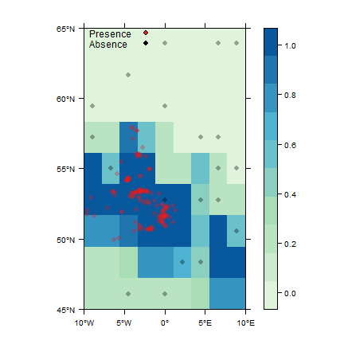
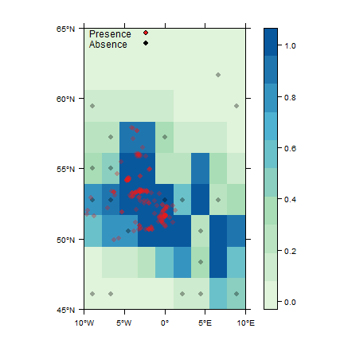

An Introduction to the **zoon** package
=======================================

**Zoon** is a package to aid reproducibility and between-model comparisons in species distribution modelling. Each step in an analysis is a 'module'. These modules will include: 

* Data collections of **occurrence** and environmental **covariate** data from online databases or local files. 
* **Process** steps such as removal of spatial autocorrelation in the data or generation of background pseudoabsences.
* The fitting of **models**.
* Model **output** including diagnostics, reports and vizualisation.


Getting set up
----------------------------

Zoon is on CRAN and can be insalled like this:

```r
install.packages('zoon')
```


Alternativly you can install the most up to date development version of Zoon from Github

```r
library(devtools)
install_github('zoonproject/zoon')
```

and load


```r
library(zoon)
```

Basic usage
----------------------------

A basic worklow is run using the `workflow` function. We must chose a module for each type: occurrence, covariate, process, model and output.


```r
work1 <- workflow(occurrence = UKAnophelesPlumbeus,
                  covariate  = UKAir,
                  process    = OneHundredBackground,
                  model      = RandomForest,
                  output     = PrintMap)
```


```r
class(work1)
```

```
## [1] "zoonWorkflow"
```

```r
str(work1, 1)
```

```
## List of 9
##  $ occurrence.output:List of 1
##  $ covariate.output :List of 1
##  $ process.output   :List of 1
##  $ model.output     :List of 1
##  $ report           :List of 1
##  $ call             : chr "workflow(occurrence = UKAnophelesPlumbeus, covariate = UKAir, process = OneHundredBackground, model = RandomForest, output = Pr"| __truncated__
##  $ call.list        :List of 5
##  $ session.info     :List of 7
##   ..- attr(*, "class")= chr "sessionInfo"
##  $ module.versions  :List of 5
##  - attr(*, "class")= chr "zoonWorkflow"
```

In this case we are using the following modules which do the following things:

* `UKAnophelesPlumbeus`: Uses occurrence points of _Anopheles plumbeus_ in the UK collected from GBIF
* `UKAir`: Uses NCEP air temperature data for the UK
* `OneHundredBackground`: Randomly creates 100 pseudoabsence or background datapoints
* `RandomForest`: Run a random forest to model the relationship between _A. plumbeus_ and air temperature
* `PrintMap`: Predicts the model across the whole of the covariate dataset (`UKAir` in this case) and prints to graphics device. 

The object returned from the workflow function (`work1` in the above example) is an object of class `zoonWorkflow`. This object is a list with all the data, models and output we collected and created in our analysis.

To access the output of a particular part of the workflow you can use the accessor functions which have the same names as the modules. For example if you want the data returned from the occurrence module you can use the `Occurrence()` accessor function


```r
# Use the Occurrence function to get occurrence module
# output from the workflow object

occ_out <- Occurrence(work1)

head(occ_out)
```

```
##     longitude latitude value     type fold
## 1  1.01287600 52.37696     1 presence    1
## 2 -0.16003467 51.57146     1 presence    1
## 3 -2.83497900 53.40813     1 presence    1
## 4 -0.62955210 51.55540     1 presence    1
## 5 -3.52534680 56.04848     1 presence    1
## 6  0.01144066 51.58168     1 presence    1
```

To find out more about the elements returned from each module there is a summary at the end of the 'Building a Module' vignette. In this instance a data frame is returned showing all of the occurrence data that is returned by the occurrence module.


Getting Help
--------------

To find a list of modules available on the online repository use


```r
GetModuleList()
```

To find help on a specific module use


```r
ModuleHelp(LogisticRegression)
```
Note that you can't use `?` as the modules are held on a repository. Therefore the module documentation files are not included with the basic zoon install.


More complex analyses
-----------------------

The syntax for including arguments to modules is simply `ModuleName(parameter = 'value')`. For example, to do two fold crossvalidation we do


```r
work2 <- workflow(occurrence = UKAnophelesPlumbeus,
                  covariate  = UKAir,
                  process    = BackgroundAndCrossvalid(k = 2),
                  model      = LogisticRegression,
                  output     = PerformanceMeasures)
```

```
## Model performance measures:
```

```
## auc :  0.667290517467822
```

```
## kappa :  0.464271488887118
```

```
## omissions :  0
```

```
## sensitivity :  1
```

```
## specificity :  0.382716049382716
```

```
## proportionCorrect :  0.814126394052045
```

```
## 
```

Here we are providing an argument to the module `BackgroundAndCrossvalid`. We are setting `k` (the number of cross validation folds) to 2.

We are using an output module `PerformanceMeasures` which calculates a number of measures of the effectiveness of our model: AUC, kappa, sensitivity, specificity etc.


### Multiple modules with Chain

We might want to combine multiple modules in our analysis. For this we use the function Chain.


```r
work3 <- workflow(occurrence = UKAnophelesPlumbeus,
                  covariate  = UKAir,
                  process    = Chain(OneHundredBackground, Crossvalidate),
                  model      = LogisticRegression,
                  output     = PerformanceMeasures)
```

```
## Model performance measures:
```

```
## auc :  0.662693722090885
```

```
## kappa :  0.424773048214646
```

```
## omissions :  0
```

```
## sensitivity :  1
```

```
## specificity :  0.345679012345679
```

```
## proportionCorrect :  0.802973977695167
```

```
## 
```

Here we draw some pseudoabsence background points, and do crossvalidation (which is the same as `work2`, but explicitely using the separate modules.)

The effect of `Chain` depends on the module type:

* `occurrence`: All data from chained modules are combined.
* `covariate`: All raster data from chained modules are stacked.
* `process`: The processes are run sequentially, the output of one going into the next.
* `model`: Model modules cannot be chained.
* `output`: Each output module that is chained is run separately on the output from the other modules.

`Chain` can be used on as many module type as is required.

### Multiple modules with list

If you want to run separate analyses that can then be compared for example, specifiy a list of modules.


```r
work4 <- workflow(occurrence = UKAnophelesPlumbeus,
                  covariate  = UKAir,
                  process    = OneHundredBackground,
                  model      = list(LogisticRegression, RandomForest),
                  output     = PrintMap)
```


```r
str(work4, 1)
```

```
## List of 9
##  $ occurrence.output:List of 1
##  $ covariate.output :List of 1
##  $ process.output   :List of 1
##  $ model.output     :List of 2
##  $ report           :List of 2
##  $ call             : chr "workflow(occurrence = UKAnophelesPlumbeus, covariate = UKAir, process = OneHundredBackground, model = list(LogisticRegression, "| __truncated__
##  $ call.list        :List of 5
##  $ session.info     :List of 7
##   ..- attr(*, "class")= chr "sessionInfo"
##  $ module.versions  :List of 5
##  - attr(*, "class")= chr "zoonWorkflow"
```

Here, the analysis is split into two and both logistic regression and random forest (a machine learning algorithm) are used to model the data. Looking at the structure of the output we can see that the output from the first three modules are a list of length one. When the analysis splits into two, the output of the modules (in `work4$model.output` and `work4$report`) is then a list of length two. One for each branch of the split analysis.

### Repeating a module multiple times

If you want to repeat a module multiple times you can use `Replicate`. This can be useful when using modules that have a random process such as the creation of pseudoabsences.


```r
work5 <- workflow(occurrence = UKAnophelesPlumbeus,
                  covariate  = UKAir,
                  process    = Replicate(Background(n = 20), n = 3),
                  model      = RandomForest,
                  output     = PrintMap)
```



`Replicate` takes as its first arguement the module you want to repeat and as its second argument the number of times yo want to repeat it. Here we end up running our model three times for three different sets out background points

### Auxillary information in a ZoonWorkflow

A `ZoonWorkflow` object (such as `work5` above), has a number of auxillary elements to help you interpret its contents.


```r
# call gives the R call used to create the workflow
work5$call
```

```
## [1] "workflow(occurrence = UKAnophelesPlumbeus, covariate = UKAir, process = Replicate(Background(n = 20), n = 3), model = RandomForest, output = PrintMap, forceReproducible = FALSE)"
```

```r
# session.info gives the session info when the 
# workflow was created
work5$session.info
```

```
## R version 3.2.3 (2015-12-10)
## Platform: x86_64-w64-mingw32/x64 (64-bit)
## Running under: Windows 7 x64 (build 7601) Service Pack 1
## 
## locale:
## [1] LC_COLLATE=English_United Kingdom.1252 
## [2] LC_CTYPE=English_United Kingdom.1252   
## [3] LC_MONETARY=English_United Kingdom.1252
## [4] LC_NUMERIC=C                           
## [5] LC_TIME=English_United Kingdom.1252    
## 
## attached base packages:
## [1] splines   stats     graphics  grDevices utils     datasets  methods  
## [8] base     
## 
## other attached packages:
##  [1] zoon_0.4.27         SDMTools_1.1-221    randomForest_4.6-12
##  [4] gam_1.12            foreach_1.4.3       spocc_0.4.5        
##  [7] MASS_7.3-45         dismo_1.0-15        knitr_1.12.3       
## [10] raster_2.5-2        sp_1.2-3           
## 
## loaded via a namespace (and not attached):
##  [1] Rcpp_0.12.4       rvertnet_0.4.4    lubridate_1.5.6  
##  [4] lattice_0.20-33   assertthat_0.1    digest_0.6.9     
##  [7] V8_1.0.1          R6_2.1.2          plyr_1.8.3       
## [10] chron_2.3-47      evaluate_0.9      httr_1.1.0       
## [13] rbison_0.4.8      ggplot2_2.1.0     curl_0.9.7       
## [16] data.table_1.9.6  whisker_0.3-2     R.utils_2.3.0    
## [19] R.oo_1.20.0       oai_0.2.0         rmarkdown_0.9.5  
## [22] devtools_1.11.0   rgdal_1.1-8       stringr_1.0.0    
## [25] RCurl_1.95-4.8    munsell_0.4.3     httpuv_1.3.3     
## [28] htmltools_0.3.5   rgeos_0.3-19      geoaxe_0.1.0     
## [31] roxygen2_5.0.1    codetools_0.2-14  XML_3.98-1.4     
## [34] rgbif_0.9.3       crayon_1.3.1      dplyr_0.4.3      
## [37] withr_1.0.1       bitops_1.0-6      R.methodsS3_1.7.1
## [40] grid_3.2.3        jsonlite_0.9.19   gtable_0.2.0     
## [43] DBI_0.4           magrittr_1.5      formatR_1.3      
## [46] scales_0.4.0      stringi_1.0-1     mapproj_1.2-4    
## [49] ridigbio_0.3.3    rebird_0.3.0      testthat_0.11.0  
## [52] xml2_0.1.2        rfigshare_0.3.7   iterators_1.0.8  
## [55] tools_3.2.3       RJSONIO_1.3-0     maps_3.1.0       
## [58] parallel_3.2.3    yaml_2.1.13       colorspace_1.2-6 
## [61] memoise_1.0.0
```

```r
# module versions lists the modules used at each
# step and which version number they were
work5$module.versions
```

```
## $occurrence
##         [,1]                 
## module  "UKAnophelesPlumbeus"
## version "local copy"         
## 
## $covariate
##         [,1]        
## module  "UKAir"     
## version "local copy"
## 
## $process
##         [,1]         [,2]         [,3]        
## module  "Background" "Background" "Background"
## version "1.1"        "1.1"        "1.1"       
## 
## $model
##         [,1]          
## module  "RandomForest"
## version "1.0"         
## 
## $output
##         [,1]        
## module  "PrintMap"  
## version "local copy"
```

When using lists in a workflow (as in `work4` above) the workflow becomes forked. For example when `work4` was created two models where run leading to two output maps. We can easily trace back the origins of any module output using the attribute `call_path`


```r
# work4 has two output maps, find the origins of the first
# using the Output accessor function and the call_path
# attribute
attr(Output(work4)[[1]], which = 'call_path')
```

```
## $occurrence
## [1] "UKAnophelesPlumbeus"
## 
## $covariate
## [1] "UKAir"
## 
## $process
## [1] "OneHundredBackground"
## 
## $model
## [1] "LogisticRegression"
## 
## $output
## [1] "PrintMap"
```

### A larger example

Here is an example of a larger analysis.


```r
work6 <- workflow(occurrence = Chain(SpOcc(species = 'Eresus kollari', 
                                       extent = c(-10, 10, 45, 65)),
                                     SpOcc(species = 'Eresus sandaliatus', 
                                       extent = c(-10, 10, 45, 65))),
                  covariate = UKAir,
                  process = BackgroundAndCrossvalid(k = 2),
                  model = list(LogisticRegression,
                               RandomForest),
                  output = Chain(PrintMap(plot = FALSE),
                                 PerformanceMeasures)
         )
```

```
## Model performance measures:
```

```
## auc :  0.580405191516303
```

```
## kappa :  -0.152941176470588
```

```
## omissions :  1
```

```
## sensitivity :  0
```

```
## specificity :  0.876543209876543
```

```
## proportionCorrect :  0.591666666666667
```

```
## 
```

```
## Model performance measures:
```

```
## auc :  0.901076289965179
```

```
## kappa :  0.727767695099819
```

```
## omissions :  0.102564102564103
```

```
## sensitivity :  0.897435897435897
```

```
## specificity :  0.864197530864197
```

```
## proportionCorrect :  0.875
```

```
## 
```

```r
# Take a look at the structure of the workflow object
str(work6, 1)
```

```
## List of 9
##  $ occurrence.output:List of 1
##  $ covariate.output :List of 1
##  $ process.output   :List of 1
##  $ model.output     :List of 2
##  $ report           :List of 4
##  $ call             : chr "workflow(occurrence = Chain(SpOcc(species = \"Eresus kollari\", extent = c(-10, 10, 45,      65)), SpOcc(species = \"Eresus san"| __truncated__
##  $ call.list        :List of 5
##  $ session.info     :List of 7
##   ..- attr(*, "class")= chr "sessionInfo"
##  $ module.versions  :List of 5
##  - attr(*, "class")= chr "zoonWorkflow"
```

```r
# Create some custom plots using the raster returned from 
# the output module
par(mfrow = c(2,1), mar = c(3,4,6,4))
plot(Output(work6)[[1]], 
     main = paste('Logistic Regression: AUC = ', 
             round(Output(work6)[[2]]$auc, 2)),
     xlim = c(-10, 10))
plot(Output(work6)[[3]],
  main = paste('Random forest: AUC = ', 
             round(Output(work6)[[4]]$auc, 2)))
```


Here we are collecting occurrence data for two species, _Eresus kollari_ and _E. sandaliatus_ and combining them (having presumably decided that this is ecologically appropriate). We are using the air temperature data from NCEP again. We are sampling 100 pseudo absence points and running two fold crossvalidation.

We run logistic regression and random forest on the data separately. We then predict the model back over the extent of our environmental data and calculate some measures of how good the models are. Collating the output into one plot we can see the very different forms of the models and can see that the random forest has a higher AUC (implying it predicts the data better).
